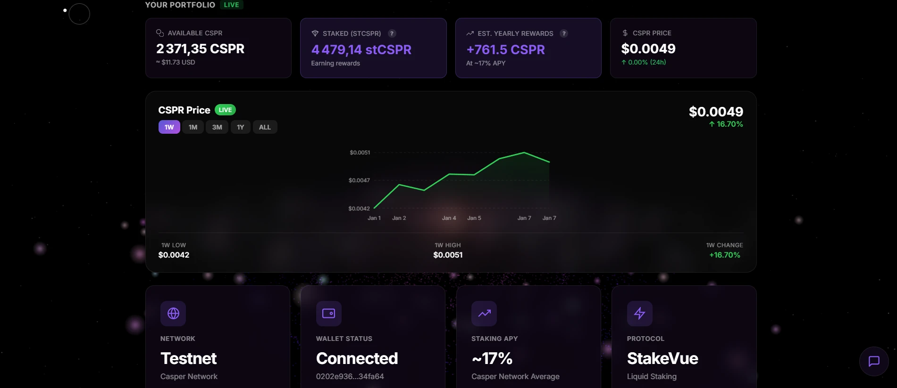
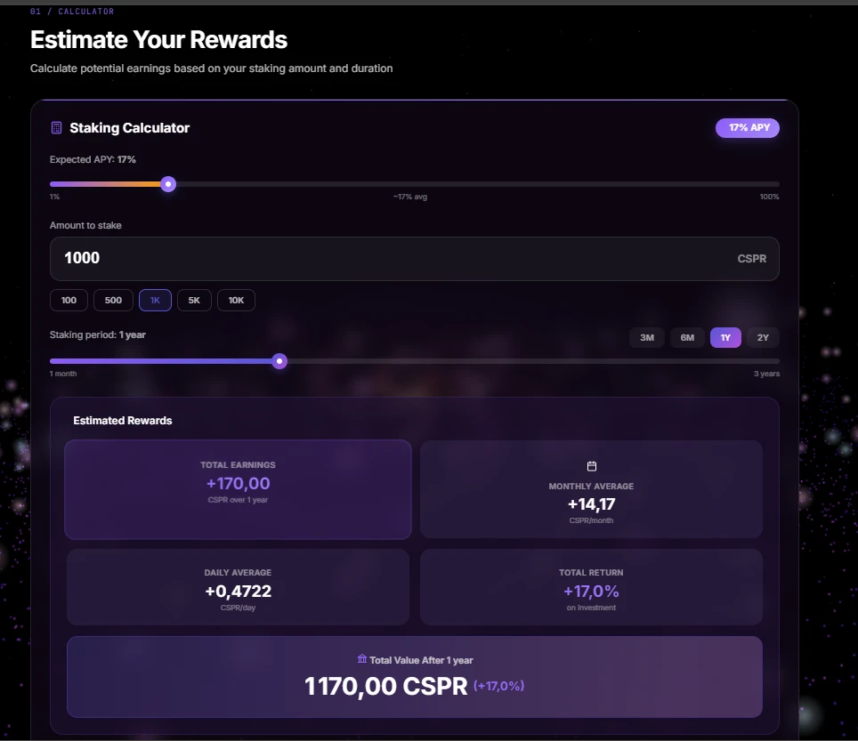
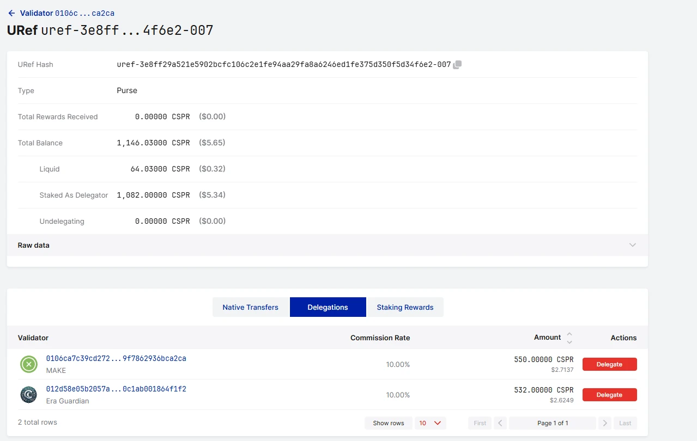

# 🚀 StakeVue - Liquid Staking on Casper 2.0

<p align="center">
  
  
  
  
</p>

<p align="center">
  <b>🏆 Casper Hackathon 2025 | DeFi Track | DoraHacks</b>
</p>

<p align="center">
  <i>"Your CSPR shouldn't sit in jail while earning rewards"</i>
</p>

---

## 💡 The Pitch 

You know what sucks? Staking your crypto and watching it sit there, **locked**, while the market moves.

**StakeVue fixes this.**

Stake your CSPR → Get stCSPR tokens → Use them anywhere → Still earn rewards 🎉

```
Traditional Staking:     💰 ──────────────────────────> 🔒 (locked for weeks)
                              "sorry, can't touch this"

StakeVue:               💰 ────> 🪙 stCSPR ────> 🌍 DeFi / Trade / Hold
                              "here's your liquid token, go wild"
```

---

## 🎬 See It In Action

### The Demo

```
┌─────────────────────────────────────────────────────────────────┐
│  MONDAY MORNING ☕                                               │
│                                                                 │
│  You: "I have 1000 CSPR, want to stake but might need it..."   │
│                                                                 │
│  > Click STAKE                                                  │
│  > Select validator "MAKE Staking"                              │
│  > Confirm in wallet                                            │
│                                                                 │
│  ✨ You now have 1000 stCSPR                                    │
│  ✨ Your CSPR is earning ~17% APY                               │
│  ✨ But you can STILL use those stCSPR tokens!                  │
└─────────────────────────────────────────────────────────────────┘

┌─────────────────────────────────────────────────────────────────┐
│  3 MONTHS LATER 📈                                              │
│                                                                 │
│  Your 1000 stCSPR is now worth 1,042 CSPR (+4.2% rewards)      │
│                                                                 │
│  Option A: Keep earning                                         │
│  Option B: Unstake and get your 1,042 CSPR                     │
│  Option C: Trade your stCSPR on DEX (coming soon!)             │
│                                                                 │
│  You choose B:                                                  │
│  > Click UNSTAKE                                                │
│  > Wait ~14 hours                                               │
│  > Click CLAIM                                                  │
│  > 💰 1,042 CSPR in your wallet!                                │
└─────────────────────────────────────────────────────────────────┘
```

---

## 📸 Screenshots

<p align="center">
  
  <br><em>Landing page with real-time CSPR stats and staking interface</em>
</p>

<p align="center">
  
  <br><em>Portfolio dashboard showing your staked assets and rewards</em>
</p>

<p align="center">
  
  <br><em>Stake form with validator selection and transaction history</em>
</p>

<p align="center">
  
  <br><em>Interactive rewards calculator to simulate your earnings</em>
</p>

<p align="center">
  
  <br><em>Browse and select from approved validators</em>
</p>

<p align="center">
  
  <br><em>Master Liquid Staking - Complete educational guide</em>
</p>

<p align="center">
  
  <br><em>Frequently Asked Questions with expandable answers</em>
</p>

### 🔗 On-Chain Proof

<p align="center">
  
  <br><em>Real contract data on <a href="https://testnet.cspr.live/uref/uref-3e8ff29a521e5902bcfc106c2e1fe94aa29fa8a6246ed1fe375d350f5d34f6e2-007">cspr.live</a> showing 1,146 CSPR TVL</em>
</p>

### 🔐 Admin Operations Proof

<p align="center">
  
  <br><em>Verified admin operations on Casper Testnet 2.0</em>
</p>

<p align="center">
  <a href="https://testnet.cspr.live/deploy/8a8bdc17b37e54fa9ebc80911d89805bacc4e0447bc51e8eff0c63c09a74d1af">🔗 Claim Transaction</a> •
  <a href="https://testnet.cspr.live/deploy/7c8fbf09003e3b5993867435efe0208882ffe4958772cf9f642deca7ac66b402">🔗 Admin Delegate</a> •
  <a href="https://testnet.cspr.live/deploy/b146e82cb373ed6c5354c16ad2649428ec970fc332bed7e58d41fea06671dcbe">🔗 Admin Undelegate</a> •
  <a href="https://testnet.cspr.live/deploy/e2779ff03b264cdeba7f748e79fdda1b695ca2f0b09215a82d57108b2c72b422">🔗 Admin Add Liquidity</a>
</p>

---

## 🎭 Who Is This For?

### 🦈 **The DeFi Shark**
> "I need my assets working in multiple places at once"

You stake 10,000 CSPR, get 10,000 stCSPR. Now you can:
- Use stCSPR as collateral on lending protocols
- Provide liquidity on DEXes
- **AND** earn staking rewards simultaneously

**Double-dipping? We call it capital efficiency.** 😎

---

### 🐢 **The Patient Hodler**
> "I'm here for 5 years, just want maximum returns"

You stake and forget. Your stCSPR automatically appreciates:

| Time | Your stCSPR Value | Profit |
|------|-------------------|--------|
| Day 1 | 1,000 CSPR | - |
| Month 3 | 1,042 CSPR | +42 CSPR |
| Month 6 | 1,085 CSPR | +85 CSPR |
| Year 1 | 1,170 CSPR | +170 CSPR |

**No claiming rewards. No compounding manually. It just grows.** 🌱

---

### ⚡ **The Active Trader**
> "I need flexibility, markets move fast"

Traditional staking: 21 days unbonding 😱
StakeVue: ~14 hours unbonding 🚀

```
08:00 - You see a trading opportunity
08:01 - Request unstake on StakeVue
22:00 - Claim your CSPR
22:01 - Execute your trade
```

**You don't have to choose between staking and trading.**

---

### 🏦 **The Whale**
> "I have serious capital and need serious solutions"

- ✅ Multi-validator distribution (spread your risk)
- ✅ Multiple vetted validators supported
- ✅ No minimum unstake (need 50 CSPR back? no problem)
- ✅ Transparent on-chain tracking

---

## 🔥 Why StakeVue Over Alternatives?

| Feature | Native Staking | Other LSDs | **StakeVue** |
|---------|---------------|------------|--------------|
| Unbonding Time | 14+ days | Varies | **~14 hours** |
| Liquid Token | ❌ No | ✅ Yes | ✅ **stCSPR** |
| Multi-Validator | ❌ Manual | Sometimes | ✅ **Built-in** |
| Casper 2.0 Native | N/A | ❌ Most are V1 | ✅ **Yes** |
| Open Source | N/A | Sometimes | ✅ **100%** |
| Minimum Stake | 500 CSPR | Varies | **1 CSPR** |

---

## 🧮 The Math (Because Numbers Don't Lie)

### Exchange Rate Magic

Your stCSPR doesn't change in quantity, it changes in **value**:

```
┌────────────────────────────────────────────────────────────┐
│                    EXCHANGE RATE GROWTH                    │
├────────────────────────────────────────────────────────────┤
│                                                            │
│  Rate                                                      │
│   ^                                                        │
│   │                                          ╭─── 1.17     │
│   │                                    ╭─────╯             │
│   │                              ╭─────╯                   │
│   │                        ╭─────╯                         │
│   │                  ╭─────╯                               │
│   │            ╭─────╯                                     │
│   │      ╭─────╯                                           │
│   │ 1.00 ╯                                                 │
│   └──────────────────────────────────────────────────> Time│
│       Day 1              6 months              1 year      │
│                                                            │
│   💡 1 stCSPR = 1.00 CSPR → 1.17 CSPR over 1 year         │
└────────────────────────────────────────────────────────────┘
```

### Real Example

```javascript
// Alice stakes 5,000 CSPR on January 1st
stake(5000 CSPR) → receive 5,000 stCSPR

// Exchange rate = 1.0
// Her stCSPR value = 5,000 CSPR

// Fast forward to July 1st
// Validators earned rewards, admin harvested them
// Exchange rate = 1.085

// Alice's 5,000 stCSPR is now worth:
5,000 × 1.085 = 5,425 CSPR

// She made 425 CSPR (~8.5%) in 6 months! 🎉
// Annualized: ~17% APY
```

---

## 🏗️ How It Actually Works

### The Pool Architecture

We tried the "obvious" approach (contract delegates directly). **It failed.** Casper 2.0 has a purse model that doesn't allow it.

So we built something better:

```
                    ┌─────────────────────────────────────┐
                    │         THE STAKEVUE POOL           │
                    ├─────────────────────────────────────┤
                    │                                     │
  USERS             │         💰 CSPR POOL 💰            │           VALIDATORS
  ─────             │         ═══════════════            │           ──────────
                    │                                     │
 Alice ──stake()──> │  ┌─────────────────────────┐       │
       <──stCSPR─── │  │  Current Pool: 50,000   │       │ ┌──────────────────┐
                    │  │  Total stCSPR: 48,000   │       │ │  MAKE Staking    │
 Bob ────stake()──> │  │  Exchange Rate: 1.04    │       │ │  ────────────    │
     <────stCSPR─── │  └─────────────────────────┘       │ │  Delegated: 20k  │
                    │                                     │ └──────────────────┘
 Carol ─unstake()─> │         │           │              │
       <───CSPR──── │         │   ADMIN   │              │ ┌──────────────────┐
                    │         │  actions  │              │ │  Bit Cat #96     │
                    │         ▼           ▼              │ │  ────────────    │
                    │  ┌─────────────────────────┐       │ │  Delegated: 15k  │
                    │  │ delegate() undelegate() │───────│►└──────────────────┘
                    │  │ harvest()  addLiquidity │       │
                    │  └─────────────────────────┘       │ ┌──────────────────┐
                    │                                     │ │  Era Guard       │
                    │                                     │ │  ────────────    │
                    │                                     │ │  Delegated: 15k  │
                    └─────────────────────────────────────┘ └──────────────────┘
```

### User Flow (Simplified)

```
1️⃣ STAKE
   You ──[10 CSPR]──> Pool
   Pool ──[10 stCSPR]──> You
   (Admin will delegate your CSPR to validators later)

2️⃣ EARN
   Validators earn rewards
   Admin harvests rewards → Exchange rate goes up
   Your stCSPR is worth more CSPR!

3️⃣ UNSTAKE
   You ──[10 stCSPR]──> Pool (burned 🔥)
   Pool creates withdrawal request
   Wait ~14 hours (7 eras)

4️⃣ CLAIM
   You ──[request_id]──> Pool
   Pool ──[10.4 CSPR]──> You (original + rewards!)
```

---

## 🛡️ Security (We Take This Seriously)

### Audit Score: 95/100

| Check | Status | Details |
|-------|--------|---------|
| Reentrancy | ✅ Safe | Casper's execution model prevents it |
| Overflow | ✅ Protected | u512_to_u256 saturation check |
| Access Control | ✅ Ownable | Only owner can call admin functions |
| Rate Manipulation | ✅ Limited | harvest_rewards capped at 10% of pool |
| CEP-18 Compliance | ✅ Full | Standard token interface |

### What We Protect Against

```
❌ Attacker tries to drain pool via overflow
   → u512_to_u256() returns MAX instead of wrapping

❌ Malicious admin tries to inflate rewards
   → harvest_rewards() limited to 10% of pool per call

❌ Someone tries to claim another user's withdrawal
   → Each request is tied to staker address

❌ Front-running unstake requests
   → Requests use sequential IDs, FIFO processing
```

---

## 🚀 Quick Start

### Try It Now (Testnet)

1. **Get testnet CSPR**: https://faucet.casper.network
2. **Open StakeVue**: https://casper-projet.vercel.app
3. **Connect wallet** (Casper Wallet, Ledger, or MetaMask Snap)
4. **Stake!**

### For Developers

```bash
# Clone the repo
git clone https://github.com/le-stagiaire-ag2r/Casper-projet.git
cd Casper-projet

# Run the frontend
cd client
npm install
npm start

# Build the contract
cd ../stakevue_contract
cargo odra build

# Run tests (12 tests, all passing ✅)
cargo odra test
```

### Project Structure

```
Casper-projet/
├── client/                 # React frontend (Vercel deployed)
│   ├── api/               # Vercel serverless APIs
│   │   ├── contract-stats.js      # TVL & pool statistics
│   │   ├── validator-delegations.js # Delegation data
│   │   └── price.js               # CSPR price from CoinGecko
│   ├── src/
│   │   ├── components/    # React components
│   │   ├── services/      # API & blockchain services
│   │   ├── hooks/         # Custom React hooks
│   │   └── pages/         # Page components
│   └── vercel.json        # Vercel configuration
├── scripts/               # Admin helper scripts
│   ├── add-rewards.js     # Reward distribution script
│   └── check-stats.js     # Pool statistics checker
├── stakevue_contract/     # Odra smart contract
│   ├── src/lib.rs         # Main contract code
│   └── Odra.toml          # Contract configuration
└── archive/               # Historical versions & docs
```

---

## 📊 Live Stats

| Metric | Value |
|--------|-------|
| **Contract** | [`2d6a39...`](https://testnet.cspr.live/contract/2d6a399bca8c71bb007de1cbcd57c7d6a54dc0283376a08fe6024a33c02b0ad3) |
| **Network** | Casper Testnet 2.0 |
| **Framework** | Odra 2.5.0 |
| **Total Value Locked** | ~1,146 CSPR |
| **Active Delegations** | 2 validators |
| **Validators Approved** | 11 |
| **Tests** | 12/12 passing |
| **Unbonding** | ~14 hours (7 eras) |

### Current Delegation Distribution

```
┌────────────────────────────────────────────────────────────┐
│                  TVL BREAKDOWN (~1,146 CSPR)               │
├────────────────────────────────────────────────────────────┤
│                                                            │
│  💧 Liquid (in contract)        ~64 CSPR   ████░░░░░░  5%  │
│  🔒 Delegated to MAKE           550 CSPR   ██████████ 48%  │
│  🔒 Delegated to Validator #4   532 CSPR   █████████░ 47%  │
│                                                            │
│  Total: ~1,146 CSPR earning ~10% APY on testnet           │
└────────────────────────────────────────────────────────────┘
```

---

## 🤔 FAQ

<details>
<summary><b>Is my CSPR safe?</b></summary>

Your CSPR goes into a smart contract pool. The contract is:
- Open source (audit it yourself!)
- Using battle-tested Odra modules
- Protected against common attacks

That said, this is testnet. Always DYOR.
</details>

<details>
<summary><b>What if I need my CSPR urgently?</b></summary>

Unbonding takes ~14 hours. If you need CSPR faster, you could (once DEX integration is live) swap your stCSPR directly on a DEX.
</details>

<details>
<summary><b>How are validators chosen?</b></summary>

Validators are whitelisted by the admin. The contract supports multiple validators for risk distribution.
</details>

<details>
<summary><b>What are the fees?</b></summary>

Currently: **0% protocol fee**. Validators take their standard commission from rewards (varies by validator, typically 5-15%).
</details>

<details>
<summary><b>Can I lose money?</b></summary>

Your stCSPR should always be worth at least what you put in, plus rewards. However:
- Validator slashing (rare on Casper)
- Smart contract risk
- Market risk if trading stCSPR

Not financial advice!
</details>

---

## 🆕 What's New in V23

### Admin Panel Dashboard

V23 introduces a comprehensive admin dashboard for managing the staking pool:

```
┌─────────────────────────────────────────────────────────────────┐
│                     🔐 ADMIN PANEL                              │
├─────────────────────────────────────────────────────────────────┤
│                                                                 │
│  ┌─────────────┐  ┌─────────────┐  ┌─────────────┐  ┌─────────┐│
│  │ Add Rewards │  │  Delegate   │  │ Undelegate  │  │ Add Liq ││
│  └─────────────┘  └─────────────┘  └─────────────┘  └─────────┘│
│                                                                 │
│  📊 Pool Stats                                                  │
│  ├── Total Pool: 1,146 CSPR                                    │
│  ├── Liquid: 64 CSPR                                           │
│  └── Delegated: 1,082 CSPR                                     │
│                                                                 │
│  📋 Validator Delegations                                       │
│  ├── #1 MAKE: 550 CSPR ✅                                      │
│  ├── #4 Validator: 532 CSPR ✅                                 │
│  └── #2-#11: Not delegated                                     │
│                                                                 │
└─────────────────────────────────────────────────────────────────┘
```

### Admin Functions Explained

| Function | Description |
|----------|-------------|
| **Add Rewards** | Distribute staking rewards to increase exchange rate |
| **Delegate** | Send CSPR from pool to a validator (minimum 500 CSPR) |
| **Undelegate** | Recall CSPR from validator (~14 eras unbonding) |
| **Add Liquidity** | Return undelegated CSPR to liquid pool |

### Analytics Dashboard

- **Real-time TVL tracking** - Contract TVL, not network total
- **Delegation breakdown** - See exactly which validators hold your pool's CSPR
- **Historical charts** - TVL evolution over time
- **CSPR.cloud integration** - Live price data and network stats

---

## 📜 Version History

| Version | Date | Highlights |
|---------|------|------------|
| **V23** | Jan 2026 | **Analytics & Admin Panel** - Live TVL tracking, delegation dashboard, multi-validator management, CSPR.cloud integration |
| **V22** | Dec 2025 | SDK Compatibility - U512 for request_unstake, fixes Error 19 |
| **V21** | Dec 2025 | Odra 2.5.0 framework upgrade |
| **V20** | Dec 2025 | Pool Architecture (Wise Lending style) - fixes error 64658 |
| **V19** | Dec 2025 | Native Odra delegation attempt (failed) |
| **V18** | Dec 2025 | Delegation debug tools |
| **V17** | Dec 2025 | Multi-validator delegation |
| **V16** | Dec 2025 | Visual overhaul, validator selector |
| **V15** | Dec 2025 | Exchange rate mechanism |
| **V14** | Dec 2025 | Integrated CEP-18 token |
| **V13** | Dec 2025 | Minimal payable test |
| **V8** | Dec 2025 | First Odra version |
| **V5** | Nov 2025 | Security hardening (overflow/underflow) |
| **V4** | Nov 2025 | Multi-validator support |
| **V3** | Nov 2025 | stCSPR liquid token |
| **V2** | Nov 2025 | Per-user stake tracking |
| **V1** | Nov 2025 | Initial prototype |

---

## 👥 Team

Built with ☕ and 🎵 during Casper Hackathon 2025

---

## 📜 License

MIT - Use it, fork it, improve it!

---

<p align="center">
  <b>⭐ Star this repo if you believe in liquid staking!</b>
</p>

<p align="center">
  <a href="https://casper-projet.vercel.app">Try the Demo</a> •
  <a href="https://testnet.cspr.live/contract/2d6a399bca8c71bb007de1cbcd57c7d6a54dc0283376a08fe6024a33c02b0ad3">View Contract</a> •
  <a href="https://github.com/le-stagiaire-ag2r/Casper-projet/issues">Report Bug</a>
</p>

<p align="center">
  <i>Stake smart. Stay liquid. 🌊</i>
</p>
